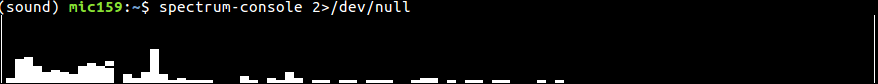

# Simple Spectrum Analyser

This is a simple example of a real-time FFT Spectrum Analyser
that runs on the console.



## Installation

```bash
sudo apt install portaudio19-dev
pip install spectrum-console
spectrum-console
```

You must make your console at least 205 characters wide.

## Using the loopback/mirror sound input

On Ubuntu, If you want to show the computer's output instead of
a microphone you can use `pavucontrol`.

`sudo apt install pavucontrol`

Navigate to the **Input Devices** tab, then change **Show** at
the bottom to **All Input Devices**.

Now check the **Set as fallback** green tick next to
**Monitor of Built-in Audio**.
